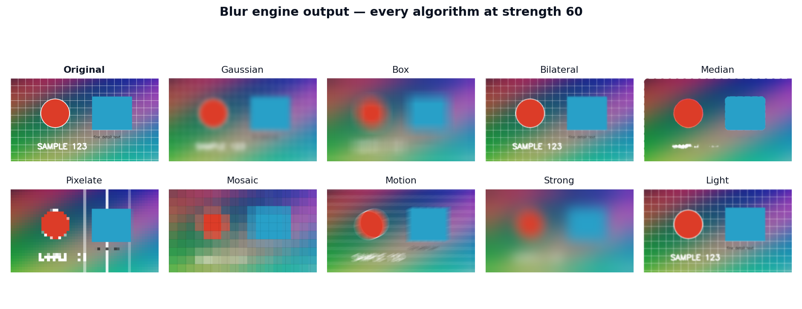

<div align="center">

# 🛡️ VisionShield

**Real-time AI privacy blur for your webcam** — faces stay sharp while the world blurs, or a hand-drawn rectangle decides what the camera may see.

FastAPI · OpenCV · MediaPipe Tasks · React · Vite · Tailwind CSS v4 · WebSockets · Docker

</div>

---

## Overview

VisionShield is a full-stack computer-vision application that captures your
webcam, runs AI detection on every frame, applies a configurable privacy
blur, and streams the result live into a React control room at 30–60 FPS.

Two operating modes:

| Mode | Behaviour |
|---|---|
| **Face Privacy** | Every face is detected and kept perfectly sharp inside a soft-edged ellipse — everything else is blurred. Multiple faces, fast motion, smooth per-frame updates. |
| **Hand Privacy** | The smallest rectangle containing both hands stays visible (or blurred — you choose). One hand expands the rectangle around it; no hands shows an informative message. |

Nine live-switchable blur algorithms — Gaussian, Box, Bilateral, Median,
Pixelate, Mosaic, Motion, Strong, Light — with a 1–100 strength slider.

## Features

- 🎥 **Live WebSocket video** — binary JPEG frames, latest-frame-wins, ~50–90 ms glass-to-glass on localhost, MJPEG fallback endpoint
- 🧠 **MediaPipe Tasks detection** — BlazeFace + 21-landmark hand model in VIDEO mode (built-in inter-frame tracking); models auto-download on first start
- 🖌️ **Soft-edged masks** — feathered ellipses/rounded rectangles, EMA box smoothing + hold-on-miss so masks never flicker during fast movement
- ⚡ **CUDA acceleration** when your OpenCV build has it, automatic CPU fallback when it doesn't
- 🎛️ **Control room UI** — mode & region switches, blur grid, debounced strength slider, detection overlay toggle, mirror toggle
- 📊 **Live telemetry** — FPS, latency, detection counter, frames, uptime, FPS sparkline, viewer count
- 🌗 **Dark/light theme**, responsive layout, loading screen, connection status, toast error notifications
- 🧱 **Clean architecture** — typed settings, thin routes, service layer, injectable detectors, 50+ tests
- 🐳 **Docker & docker-compose** for one-command deployment

## Screenshots

> Replace these placeholders with your own captures once running.

| Dashboard (Face Privacy) | Hand Privacy mode |
|---|---|
|  |  |

| Blur algorithms | API docs page |
|---|---|
|  |  |

A real output of the blur engine (generated by `scripts/generate_report.py`):



## Project structure

```
visionshield/
├── backend/
│   ├── app/
│   │   ├── config/settings.py      # env-driven typed configuration
│   │   ├── routes/                 # camera · settings · stats · stream (WS/MJPEG)
│   │   ├── services/               # CameraManager · threads · shared state
│   │   ├── vision/                 # detectors · smoothing · masking · blur · pipeline
│   │   ├── utils/                  # logging · FPS/latency meters
│   │   └── main.py                 # FastAPI app factory + lifespan
│   ├── tests/                      # 50+ unit / API / pipeline tests
│   ├── requirements.txt
│   ├── .env.example
│   └── Dockerfile
├── frontend/
│   ├── src/
│   │   ├── api/client.js           # axios + WS URL helper
│   │   ├── context/AppContext.jsx  # global state + optimistic actions
│   │   ├── hooks/useStream.js      # zero-re-render WS video consumer
│   │   ├── components/             # Navbar · VideoViewer · Controls · Stats · Toasts …
│   │   └── pages/                  # Dashboard · ApiDocs
│   ├── nginx.conf                  # production proxy (SPA + /api + /ws)
│   ├── vite.config.js              # dev proxy to the backend
│   └── Dockerfile
├── docs/
│   ├── API.md                      # full endpoint reference
│   ├── ARCHITECTURE.md             # deep-dive teaching document
│   └── report/VisionShield_Project_Report.pdf
├── scripts/generate_report.py      # rebuilds the PDF + figures from the real engine
├── docker-compose.yml
├── .env.example
└── README.md
```

## Installation

### Prerequisites

- **Python 3.10+** (3.11/3.12 recommended)
- **Node.js 18+** (20/22 recommended)
- A webcam
- Internet on first start (the two MediaPipe models, ~8 MB total, download automatically)

### 1 — Backend

```bash
cd backend

# create & activate a virtual environment
python -m venv .venv
source .venv/bin/activate            # Windows: .venv\Scripts\activate

# install dependencies
pip install -r requirements.txt

# optional: customise configuration
cp .env.example .env

# start the API (http://localhost:8000, Swagger at /docs)
uvicorn app.main:app --reload
```

### 2 — Frontend

```bash
cd frontend
npm install
npm run dev                          # http://localhost:5173
```

The Vite dev server proxies `/api` and `/ws` to `localhost:8000`, so no
CORS or URL configuration is needed in development.

### 3 — Use it

Open **http://localhost:5173**, press **Start camera**, and switch modes,
blur algorithms, strength, and region live.

## Docker

```bash
cp .env.example .env
docker compose up --build
# Frontend → http://localhost:3000    Backend → http://localhost:8000
```

> **Webcam passthrough** (`/dev/video0`) works on **Linux** hosts. Docker
> Desktop on macOS/Windows cannot expose webcams to containers — there, run
> the backend natively (section above) and use Docker for the frontend only,
> or deploy on a Linux box.

### Production notes

- Serve the frontend build (`npm run build` → `dist/`) behind nginx using the
  provided `frontend/nginx.conf` (SPA fallback + `/api` + `/ws` proxying).
- Run uvicorn with `--host 0.0.0.0 --port 8000`; a single worker is correct —
  the camera is a singleton resource (scale by machine, not by worker).
- Set `CORS_ORIGINS` in `.env` to your real origin.
- On headless servers swap `opencv-python` for `opencv-python-headless` in
  `requirements.txt`.

## Configuration

Everything lives in `.env` (see `.env.example`). Highlights:

| Variable | Default | Meaning |
|---|---|---|
| `CAMERA_INDEX` | `0` | OS camera index |
| `FRAME_WIDTH/HEIGHT` | `1280/720` | Requested capture resolution |
| `PROCESS_WIDTH` | `960` | Downscale width for processing (speed lever #1) |
| `TARGET_FPS` | `30` | Processing loop cap |
| `JPEG_QUALITY` | `80` | Stream quality vs bandwidth |
| `MASK_FEATHER_PX` | `41` | Soft-edge width |
| `SMOOTH_ALPHA` / `SMOOTH_HOLD_FRAMES` | `0.45` / `8` | Box smoothing reactivity / miss tolerance |
| `MODELS_DIR` | `models` | Where MediaPipe models are cached |

## API

Full reference in [`docs/API.md`](docs/API.md); interactive Swagger at
`http://localhost:8000/docs`.

| Method | Endpoint | Purpose |
|---|---|---|
| `POST` | `/api/camera/start` | Open webcam, start processing |
| `POST` | `/api/camera/stop` | Stop and release (idempotent) |
| `GET` | `/api/camera/status` | Lifecycle status |
| `GET/PUT` | `/api/settings` | Read / partially update pipeline settings |
| `GET` | `/api/settings/blur-types` | The nine-algorithm catalogue |
| `GET` | `/api/stats` | FPS, latency, detections, uptime… |
| `GET` | `/api/health` | Liveness probe |
| `WS` | `/ws/stream` | Binary JPEG frames + JSON stats |
| `GET` | `/api/stream/mjpeg` | MJPEG fallback |
| `GET` | `/api/stream/snapshot` | Single current frame |

## Testing

```bash
cd backend
pip install pytest httpx
python -m pytest tests/ -v
```

50+ tests cover every blur algorithm × strength, mask feathering and
compositing in both regions, EMA smoothing and hold-on-miss, the full REST
contract (including graceful no-camera failures), and the end-to-end pipeline
with injected fake detectors. Tests needing real model files auto-skip when
the models are absent.

## Troubleshooting

| Symptom | Fix |
|---|---|
| `Cannot open camera at index 0` | Close other apps using the webcam (Zoom, browser tabs); try `{"camera_index": 1}`; on Linux check `ls /dev/video*` and that your user is in the `video` group. |
| Model download fails (offline/proxy) | The error message prints the exact `curl` commands — download both files into `backend/models/` and restart. |
| Black stream / instant disconnects | Confirm the backend is on port 8000 and you opened the frontend via the dev server (5173) or nginx (3000), not the raw `dist/` files. |
| Low FPS | Lower `PROCESS_WIDTH` (e.g. 640), reduce `JPEG_QUALITY`, prefer Pixelate/Gaussian over Bilateral at high strength. |
| `ImportError: libGL.so.1` (servers) | `apt install libgl1` or switch to `opencv-python-headless`. |
| Firefox `NS_BINDING_ABORTED` frames | Harmless — object URLs are revoked on a delay by design. |

## Performance tips

1. `PROCESS_WIDTH` is the biggest lever — 640 px roughly doubles headroom.
2. VIDEO-mode tracking means hand detection gets *cheaper* after the first
   frames; don't benchmark the first second.
3. Bilateral and Median are the heaviest algorithms by design; Gaussian,
   Pixelate and Mosaic are the fastest.
4. A CUDA build of OpenCV accelerates Gaussian-family blurs automatically —
   check the CPU/CUDA chip in the stats panel.

## License

MIT © 2026 Youcef — SoftWebElevation. See [LICENSE](LICENSE).
# FaceEncoder

